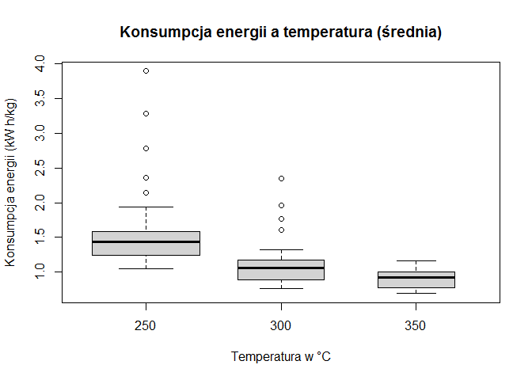
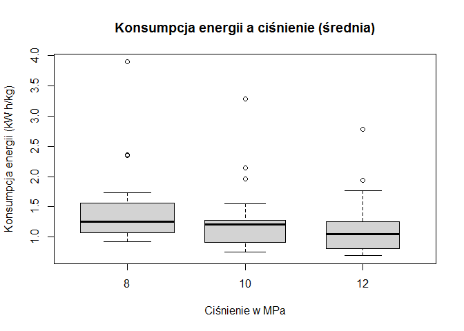
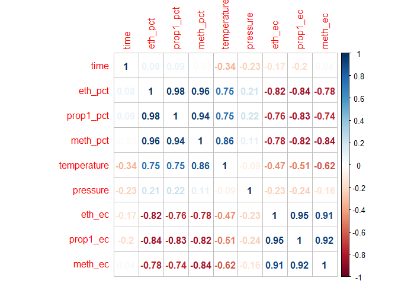
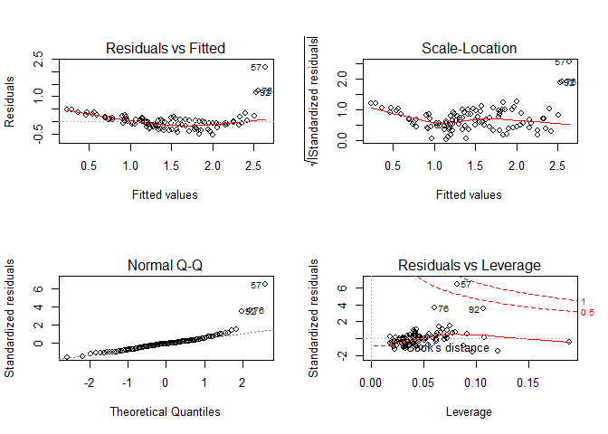

## 1. Zrozumienie uwarunkowań biznesowych

### 1.1 Biodiesel

Biodiesel jest paliwem odnawialnym wytwarzanym głównie w drodze transestryfikacji olejów i tłuszczów, które mogą być wykorzystywane jako paliwo transportowe, rozpuszczalnik i do wytwarzania energii, co może zmniejszyć emisje CO2, SO2, CO i HC w porównaniu z paliwami kopalnymi.

W przemyśle stosuje się również mieszanki paliwowe z olejem napędowym w celu otrzymania paliwa zapewniającego lepsze warunki pracy silnika. 

Biopaliwa stwarzają ogromne możliwości dla rozwoju gospodarki oraz aktywizację terenów wiejskich i zagospodarowanie nieużytków rolnych. Pozwalają na częściowe uniezależnienie energetyczne kraju od dostaw ropy oraz zmniejszenie zależności cen paliwa od zmian ceny ropy naftowej i kursów walut. 

Poza argumentami gospodarczymi możemy dostrzec pozytywny wpływ na środowisko.
Część wyemitowanego w trakcie spalania dwutlenku węgla została wcześniej wchłonięta przez rośliny, a w przypadku ON pochodzi on z ropy naftowej, w związku z tym wprowadza się mniejsze ilości dodatkowego CO2 do atmosfery.
Spalanie biopaliw nie zanieczyszcza powietrza związkami siarki, choć tutaj warto wspomnieć że powoduje emisję o około 20% więcej tlenków azotu.

Obecnie paliwo to zyskuje na popularności, w krajach Unii Europejskiej produkcja tego biopaliwa wzrasta o 20% rocznie.
Postęp technologiczny w tej dziedzinie obniża koszty produkcji przez co cena biodiesla jest porównywalna do ceny zwykłego diesla. 
Polityka proekologiczna prowadzona przez wiele państw promuje wykorzystanie odnawialnych źródeł energii, biopaliw i hybryd.
Dyrektywa europejska z 2003 roku narzuca państwom członkowskim UE wprowadzenie podatkowej promocji biopaliw. Wdrażanie jej postanowień do prawa w Polsce to m.in. zwolnienia od podatku akcyzowego .

### 1.2 Transestryfikacja nadkrytyczna

Jedną z alternatywnych metod produkcji biodiesla jest transestryfikacja nadkrytyczna.
Metoda transestryfikacji ta jest wolna od katalizatora i wykorzystuje nadkrytyczny metanol w wysokich temperaturach i ciśnieniach w procesie ciągłym. W stanie nadkrytycznym olej i metanol są w jednej fazie, a reakcja zachodzi spontanicznie i szybko. Proces może tolerować wodę w surowcu, wolne kwasy tłuszczowe są przekształcane w estry metylowe zamiast mydła, więc można stosować wiele różnych surowców. Eliminowany jest również etap usuwania katalizatora. Wymagane są wysokie temperatury i ciśnienia, ale koszty energii związane z produkcją są podobne lub mniejsze niż katalitycznych metod produkcyjnych.

### 1.3 Cel analizy

Celem poniższej analizy jest stworzenie modelu procesu krytycznej transestryfikacji który można  wykorzystać do symulacji i optymalizacji procesów produkcji biodiesla.
Analiza prowadzona jest zgodnie z metodyką CRISP-DM.


## 2. Zrozumienie danych

Otrzymane dane to wyniki pomiaru w procesie transestryfikacji.
Doświadczenia z transestryfikacją oleju rzepakowego w alkoholach nadkrytycznych (metanol, etanol i 1-propanol) prowadzono w reaktorze wsadowym w różnych temperaturach reakcji (250-350 ° C), ciśnieniu roboczym (8-12 MPa), czasie reakcji i stałym stosuneku molowym alkoholu do oleju wynoszącym 42:1. 

W pliku z wynikami doświadczenia zarejestrowano 105 pomiarów o ponizszych parametrach: 

* run_id - numer pomiaru

* b_temp - temperatura w czasie reakcji

* b_press - ciśnienie w czas reakcji

* b_time - czas reakcji

* meth_pct - stężenie metanolu

* meth_ec - konsumpcja energii dla metanolu 

* eth_pct - stężenie etanolu

* eth_ec - konsumpcja energii dla etanolu

* prop1_pct - stężenie propanol-1

* prop1_ec - konsumpcja energii dla propanol-1


## 3. Przygotowanie i analiza danych
Dane mają charakter tabelaryczny. Przypadki nie są z sobą powiązane, zmieniają się natomiast parametry pomiarów.
Dane nie wymagały czyszczenia, nie wykryto anomali oraz dziur. 


### 3.1 Statystyki opisowe


```r
summary(df[2:10])
```

```
##   temperature       pressure           time           meth_pct    
##  Min.   :250.0   Min.   : 8.000   Min.   :  7.00   Min.   :13.80  
##  1st Qu.:250.0   1st Qu.: 8.000   1st Qu.: 20.00   1st Qu.:46.20  
##  Median :300.0   Median :10.000   Median : 35.00   Median :55.00  
##  Mean   :288.6   Mean   : 9.657   Mean   : 40.27   Mean   :59.44  
##  3rd Qu.:300.0   3rd Qu.:12.000   3rd Qu.: 55.00   3rd Qu.:78.80  
##  Max.   :350.0   Max.   :12.000   Max.   :100.00   Max.   :93.00  
##     meth_ec         eth_pct          eth_ec        prop1_pct   
##  Min.   :0.612   Min.   : 9.80   Min.   :0.682   Min.   : 8.3  
##  1st Qu.:0.801   1st Qu.:39.80   1st Qu.:0.971   1st Qu.:32.7  
##  Median :1.014   Median :51.20   Median :1.144   Median :47.4  
##  Mean   :1.064   Mean   :52.63   Mean   :1.264   Mean   :47.4  
##  3rd Qu.:1.220   3rd Qu.:66.30   3rd Qu.:1.445   3rd Qu.:61.3  
##  Max.   :2.816   Max.   :91.90   Max.   :4.068   Max.   :91.1  
##     prop1_ec    
##  Min.   :0.723  
##  1st Qu.:1.072  
##  Median :1.209  
##  Mean   :1.449  
##  3rd Qu.:1.696  
##  Max.   :4.803
```

### 3.2 Wykresy ramka-wąsy

#### Wpływ temperatury na reakcje {.tabset .tabset-fade .tabset-pills}

##### Ogólny

```r
boxplot((meth_ec + eth_ec + prop1_ec)/3 ~ temperature, data = df, col = "lightgray", varwidth = TRUE, 
        main = "Konsumpcja energii a temperatura (średnia)",
        ylab = "Konsumpcja energii (kW h/kg)",xlab = "Temperatura w °C")
```

<!-- -->

##### Metanol

```r
boxplot(meth_ec ~ temperature, data = df, col = "lightgray", varwidth = TRUE, 
        main = "Konsumpcja energii a temperatura dla metanolu",
        ylab = "Konsumpcja energii (kW h/kg)",xlab = "Temperatura w °C")
```

<!-- -->

##### Etanol

```r
boxplot(eth_ec ~ temperature, data = df, col = "lightgray", varwidth = TRUE, 
        main = "Konsumpcja energii a temperatura dla etanolu",
        ylab = "Konsumpcja energii (kW h/kg)",xlab = "Temperatura w °C")
```

<!-- -->

##### Propanol

```r
boxplot(prop1_ec ~ temperature, data = df, col = "lightgray", varwidth = TRUE, 
        main = "Konsumpcja energii a temperatura dla propanolu",
        ylab = "Konsumpcja energii (kW h/kg)",xlab = "Temperatura w °C")
```

<!-- -->

####
Na podstawie wykresu konsumpcji energi do temperatury możemy wnioskować że im wyższa temperatura tym reakcja potrzebuje mniej energii. Reakcja transestryfikacji jest bardziej wydajna w wyższych temperaturach.

#### Wpływ czasu na reakcje {.tabset .tabset-fade .tabset-pills}

##### Ogólny

```r
boxplot( (meth_ec + eth_ec + prop1_ec)/3 ~ time, data = df, col = "lightgray", varwidth = TRUE, 
        main = "Konsumpcja energii a czas (średnia)",
        ylab = "Konsumpcja energii (kW h/kg)",xlab = "Czas w minutach")
```

<!-- -->

##### Metanol

```r
boxplot(meth_ec ~ time, data = df, col = "lightgray", varwidth = TRUE, 
        main = "Konsumpcja energii a czas dla metanolu",
        ylab = "Konsumpcja energii (kW h/kg)",xlab = "Czas w minutach")
```

<!-- -->

##### Etanol

```r
boxplot(eth_ec  ~ time, data = df, col = "lightgray", varwidth = TRUE, 
        main = "Konsumpcja energii a czas dla etanolu",
        ylab = "Konsumpcja energii (kW h/kg)",xlab = "Czas w minutach")
```

<!-- -->

##### Propanol

```r
boxplot(prop1_ec ~ time, data = df, col = "lightgray", varwidth = TRUE, 
        main = "Konsumpcja energii a czas dla propanolu",
        ylab = "Konsumpcja energii (kW h/kg)",xlab = "Czas w minutach")
```

<!-- -->

#### 
Możemy zauważyć że początkowy etap zużywa najwięcej energi jednak z czasem jej zużycie spada (okolice 15 - 25 minut) a następnie znóW rośnie. Możemy wysnuć hipoteze ze optymalny czas reakcji powinien wynosić 15 - 25 minut.  


#### Wpływ ciśnienia na reakcje {.tabset .tabset-fade .tabset-pills}

##### Ogólny

```r
boxplot( (meth_ec + eth_ec + prop1_ec)/3 ~ pressure, data = df, col = "lightgray", varwidth = TRUE, 
        main = "Konsumpcja energii a ciśnienie (średnia)",
        ylab = "Konsumpcja energii (kW h/kg)",xlab = "Ciśnienie w MPa")
```

<!-- -->

##### Metanol

```r
boxplot(meth_ec ~ pressure, data = df, col = "lightgray", varwidth = TRUE, 
        main = "Konsumpcja energii a ciśnienie dla metanolu",
        ylab = "Konsumpcja energii (kW h/kg)",xlab = "Ciśnienie w MPa")
```

<!-- -->

##### Etanol

```r
boxplot(eth_ec  ~ pressure, data = df, col = "lightgray", varwidth = TRUE, 
        main = "Konsumpcja energii a ciśnienie dla etanolu",
        ylab = "Konsumpcja energii (kW h/kg)",xlab = "Ciśnienie w MPa")
```

<!-- -->

##### Propanol

```r
boxplot(prop1_ec ~ pressure, data = df, col = "lightgray", varwidth = TRUE, 
        main = "Konsumpcja energii a ciśnienie dla propanolu",
        ylab = "Konsumpcja energii (kW h/kg)",xlab = "Ciśnienie w MPa")
```

<!-- -->

#### 
Ciśnienie podobnie jak czas nie wpływa znacząco na reakcje. Możemy zauważyć jednak ze wraz ze wzrostem ciśnienia maleje konsumpcja energii. Dla reakcji w wysokich temperaturach rola ciśnienia może rosnąć. 
 
 
### 3.3 Wykresy punktowe


```r
plot(c(meth_ec,eth_ec,prop1_ec), c(meth_pct,eth_pct,prop1_pct), pch = 15, col = c("#9055A2" ,"#011638", "#D499B9"), main = "Stężenie alkoholu a konsumpcja energi w procesie transestryfikacji", xlab = "Konsumpcja energii (kW h/kg)", ylab = "Stężenie procentowe alkoholu %")
```

<!-- -->

Wraz ze spadkiem stężenia procentowego wydajność procesu maleje. Na powyższych wykresach mogliśmy dostrzec pojedyńcze punkty poza ramą o wysokim poborze energii - były to przypadki o niskim stężeniu procentowym (poniżej 25%). Na podstawie tego wykresu możemy stwierdzić że wydajność reakcji zależy w dużym stopniu od zawartości alkoholu.
 

### 3.4 Korelacja

#### Korelacja w zależności od temperatury {.tabset .tabset-fade .tabset-pills}

##### Ogólny


```r
dataCorrelation <- cor(df[2:10], method = "pearson")
corrplot(dataCorrelation, method = "number", order = "AOE")
```

<!-- -->

##### Dla 250 °C

```r
df250 <- subset(df[2:10], temperature==250)
dataCorrelation <- cor(df250[2:9], method = "pearson")
corrplot(dataCorrelation, method = "number", order = "AOE")
```

<!-- -->


##### Dla 300 °C

```r
df300 <- subset(df[2:10], temperature==300)
dataCorrelation <- cor(df300[2:9], method = "pearson")
corrplot(dataCorrelation, method = "number", order = "AOE")
```

<!-- -->

##### Dla 350 °C

```r
df350 <- subset(df[2:10], temperature==350)
dataCorrelation <- cor(df350[2:9], method = "pearson")
corrplot(dataCorrelation, method = "number", order = "AOE")
```

<!-- -->

####
Wykres korelacji dla całego zbioru danych wskazuje na silną korelację między żużyciem energi a stężeniem procentowym oraz w umiarkowanym stopniu z temperaturą. Czas reakcji i ciśnienie mają słaby lub nie znaczący zwiazek z wydajnością reakcji.

Na podstawie wcześniej założonej hipotezy która mówi że "Czas i ciśnienie mają większy wpływ na wydajność w wyższych temperaturach" postanowiłem zbadać korelację dla poszczególnych temperatur. 
Dla temperatury 300 °C oraz 350 °C korelacja między wydajnościa a czasem i ciśnieniem znacząco rośnie.
Potwierdziło to hipoteze że wraz ze wzrostem temperatury, czynniki takie jak czas i ciśnienie wpływają na wydajność procesu zależnie od pochodnej alkanu.


## 4. Modelowanie

Wylosowane modele do zamodelowania procesu to:

* Model regresji wielorakiej

* Model naiwny

* ARIMA

### 4.1 Model regresji wielorakiej 

### 4.1.1 Wstęp

Ogólnym celem regresji wielorakiej jest ilościowe ujęcie związków pomiędzy wieloma zmiennymi niezależnymi (objaśniającymi) a zmienną zależną (kryterialną, objaśnianą). Model ten bardzo dobrze nadaje się do modelowania wyników analizowanego eksperymentu. 
Ogólna postać regresji wielorakiej ma postać: `Y = a + b1*X1 + b2*X2 + ... + bp*Xp`


Wśród wylosowanych modeli regresja wieloraka najlepiej nadaje się do zamodelowania zjawiska nadkrytycznej transestryfikacji. Przypadki sa z sobą luźno powiązane jednak możemy znaleźć zależności od zmiennych (temperatury, stężenia, ciśnenia i czasu)

Modelowaną zmienną będzie konsumcja energii, a wyrażenie bedzie miało postać:

**EC = A + a1 x stężenie + a2 x temperatura + a3 x czas + a4 x ciśnienie**

Gdzie:

* EC - konsumcja energii

* A - stała dla równania

* a1, a2, a3, a4 - współczynniki dla zmiennych niezależnych

Postanowiłem wykonać trzy modele dla kazdego rodzaju alkoholu. Pomimo że wszystkie trzy substancje to pochodne alkanów to różnice między nimi są znaczące. Modelowanie ich wprowadzając masę molową jako dodatkową zmienną przy testach nie przyniosło porządanych rezultatów gdyż dynamika procesów chemicznych między nimi jest zbyt duża by stworzyć dokładne modele. 

Sięgając po literaturę techniczną na temat transestryfikacji z alkoholami krytycznymi możemy zauwazyć że cięższe alkohole nie są brane pod uwagę w tym procesie. Ich reakcja z tłuszczami jest zbyt kosztowna. Etanol i propanol wprowadzono w eksperymencie dla porównania. W przemysłowej transestryfikacji używa się przeważnie podstawowego metanolu.   

### 4.1.2 Model dla metanolu


```r
# Multiple (Linear) Regression
mlr <- lm(df$meth_ec ~ df$meth_pct + df$temperature + df$time + df$pressure, data = df)
mlrCoe <- coefficients(mlr)
modelMultipleRegression_meth = mlrCoe[1] + mlrCoe[2] * df$meth_pct + mlrCoe[3] * df$temperature + mlrCoe[4] * df$time + mlrCoe[5] * df$pressure 
```


Równanie regresji wielorakiej:

```r
paste("EC = ",mlrCoe[1], " + ",  mlrCoe[2],  "x stężenie + ", mlrCoe[3], "x temperatura + ", mlrCoe[4], " x czas + ", mlrCoe[5], " x ciśnienie", collapse="")
```

```
## [1] "EC =  -0.178684309776347  +  -0.0293885839355538 x stężenie +  0.00817432977017417 x temperatura +  0.00560958845215628  x czas +  0.041957758528877  x ciśnienie"
```


Korelacja z modelem: 

```r
# Korelacja modelu i danych
cor(meth_ec, modelMultipleRegression_meth)
```

```
## [1] 0.8872191
```


Wykres danych rzeczywistych (niebieski) i modelu (czerwony)


```r
plot(c(modelMultipleRegression_meth,meth_ec), c(meth_pct,meth_pct), pch = 15, col = c("red" ,"blue"), main = "Stężenie alkoholu a konsumpcja energi", xlab = "Konsumpcja energii (kW h/kg)", ylab = "Stężenie procentowe alkoholu %")
```

<!-- -->


```r
# Histogram reszt
hist(mlr$residuals, breaks = 12, main = "Histogram reszt", xlab = "Odchylenie modelu", ylab = "Wystąpienia")
```

<!-- -->


Dodatkowa diagnostyka modelu

```r
# diagnostic plots 
layout(matrix(c(1,2,3,4),2,2)) # optional 4 graphs/page 
plot(mlr)
```

<!-- -->


MSE: 

```r
mse(meth_ec,modelMultipleRegression_meth )
```

```
## [1] 0.002431983
```


### 4.1.3 Model dla etanolu


```r
# Multiple (Linear) Regression
mlr <- lm(df$eth_ec ~ df$eth_pct + df$temperature + df$time + df$pressure, data = df)
mlrCoe <- coefficients(mlr)
modelMultipleRegression_eth = mlrCoe[1] + mlrCoe[2] * df$eth_pct + mlrCoe[3] * df$temperature + mlrCoe[4] * df$time + mlrCoe[5] * df$pressure 
```


Równanie regresji wielorakiej:

```r
paste("EC = ",mlrCoe[1], " + ",  mlrCoe[2],  "x stężenie + ", mlrCoe[3], "x temperatura + ", mlrCoe[4], " x czas + ", mlrCoe[5], " x ciśnienie", collapse="")
```

```
## [1] "EC =  0.83335540607963  +  -0.0327972455042768 x stężenie +  0.00613407271987701 x temperatura +  0.0026328085408639  x czas +  0.0290064141238418  x ciśnienie"
```


Korelacja z modelem: 

```r
# Korelacja modelu i danych
cor(eth_ec, modelMultipleRegression_eth)
```

```
## [1] 0.8447676
```


Wykres danych rzeczywistych (niebieski) i modelu (czerwony)


```r
plot(c(modelMultipleRegression_eth,eth_ec), c(eth_pct,eth_pct), pch = 15, col = c("red" ,"blue"), main = "Stężenie alkoholu a konsumpcja energi", xlab = "Konsumpcja energii (kW h/kg)", ylab = "Stężenie procentowe alkoholu %")
```

<!-- -->


```r
# Histogram reszt
hist(mlr$residuals, breaks = 12, main = "Histogram reszt", xlab = "Odchylenie modelu", ylab = "Wystąpienia")
```

<!-- -->


Dodatkowa diagnostyka modelu

```r
# diagnostic plots 
layout(matrix(c(1,2,3,4),2,2)) # optional 4 graphs/page 
plot(mlr)
```

<!-- -->

MSE: 

```r
mse(eth_ec,modelMultipleRegression_eth )
```

```
## [1] 0.02222699
```


### 4.1.4 Model dla propanol-1


```r
# Multiple (Linear) Regression
mlr <- lm(df$prop1_ec ~ df$prop1_pct + df$temperature + df$time + df$pressure, data = df)
mlrCoe <- coefficients(mlr)
modelMultipleRegression_prop1 = mlrCoe[1] + mlrCoe[2] * df$prop1_pct + mlrCoe[3] * df$temperature + mlrCoe[4] * df$time + mlrCoe[5] * df$pressure 
```


Równanie regresji wielorakiej:

```r
paste("EC = ",mlrCoe[1], " + ",  mlrCoe[2],  "x stężenie + ", mlrCoe[3], "x temperatura + ", mlrCoe[4], " x czas + ", mlrCoe[5], " x ciśnienie", collapse="")
```

```
## [1] "EC =  2.05628691367711  +  -0.033056812981459 x stężenie +  0.0035626246165506 x temperatura +  -0.00095264066594323  x czas +  -0.00311422405518002  x ciśnienie"
```


Korelacja z modelem: 

```r
# Korelacja modelu i danych
# pearson 0,848
# spearman 0,923
# kendall 0,776
cor(prop1_ec, modelMultipleRegression_prop1)
```

```
## [1] 0.8484939
```

Wykres danych rzeczywistych (niebieski) i modelu (czerwony)


```r
plot(c(modelMultipleRegression_prop1,prop1_ec), c(prop1_pct,prop1_pct), pch = 15, col = c("red" ,"blue"), main = "Stężenie alkoholu a konsumpcja energi", xlab = "Konsumpcja energii (kW h/kg)", ylab = "Stężenie procentowe alkoholu %")
```

<!-- -->


```r
# Histogram reszt
hist(mlr$residuals, breaks = 12, main = "Histogram reszt", xlab = "Odchylenie modelu", ylab = "Wystąpienia")
```

<!-- -->


Dodatkowa diagnostyka modelu

```r
# diagnostic plots 
layout(matrix(c(1,2,3,4),2,2)) # optional 4 graphs/page 
plot(mlr)
```

<!-- -->

MSE: 

```r
mse(prop1_ec,modelMultipleRegression_prop1 )
```

```
## [1] 0.03648936
```


### 4.1.4 Podsumowanie

Utworzono modele regresji wielorakiej dla 3 różnych alkoholi. Korelacja (pearson'a) między modelem a danymi wynosiła w granicach 0.84 - 0.88 natomiast spermana w okolicach 0,90 - 0.95.
Modele dosyć dobrze modelowały zjawisko za wyjątkiem skrajnych przypadków gdzie stężenie procentowe alkoholu było ponizej 25%. 

Średni kwadratowy błąd dla modeli był stosunkowo niski co czyni model akceptowalnym.
Reszty wpasowały się w rozkład normalny poza pojednyńczymi przypadkami dla wartości skrajnych z wysokim pobórem energii.

Być może model można byłoby poprawić wprowadzająć wagi dla czasu i cisnienia podczas wyższych temperatur. Pozwoliło by to na lepsze modelowanie procesu w warunkach krytycznych.


### 4.2 Model naiwny

Metoda ta stosowana jest przy stałym poziomie zjawiska i niewielkich wahaniach przypadkowych (niski współczynnik zmienności V<5-10%) i przy założeniu, że nie wystąpią istotne zmiany najważniejszych czynników.

W związku z tym że analizowane dane nie miały postaci szeregu czasowego oraz spodziewana jakość prognoz jest niska nie uwzględniłem tego modelu w swojej analizie.

### 4.3 ARIMA

Model ARIMA jest uogólnieniem modelu autoregresyjnej średniej ruchomej (ARMA). Oba te modele są dopasowane do danych szeregów czasowych, aby lepiej zrozumieć dane lub przewidzieć przyszłe punkty w serii (prognozowanie).
Modele ARIMA są stosowane w niektórych przypadkach, w których dane wskazują na niestacjonarność, gdzie początkowy etap różnicowania (odpowiadający "zintegrowanej" części modelu) można zastosować jeden lub więcej razy, aby wyeliminować niestacjonarność.

Analizowane dane nie miały postaci szeregu czasowego w związku z tym model ten nie został zastosowany w analizie.


## 5. Prognozy i ocena

W swojej pracy skupiłem się na regresji wielorakiej gdyż pozostałe modele nie miały zastosowania przy tego typu danych. Dane były wynikiem reakcji chemicznej i były sciśle zwiazane z parametrami reakcji.  

Model regresji wielorakiej najlepiej opisuje to zjawisko. Udało się stworzyć trzy modele dla kazdego z alkoholi które z dobrą jakościa przedstawiają zjawisko. Modele te mogą służyć w procesie optymalizacji procesu transestryfikacji nadkrytycznej. 

Za pomocą funkcji równań regresji wielorakiej (przedstawionych dla każdego z alkoholi) możemy dosyć dobrze zamodelować zużycie energii. Model ten w można zastosować w eksperymencie o podobnych parametrach. 
Do stworzenia lepszego modelu potrzebne były by pomiary w bardziej krytycznych warunkach. Literatura techniczna podaje ze reakcje taką można przeprowadzać pod ciśnieniem 55 MPa, 99,5% czystości alkoholu metylowym i etylowym oraz w temperaturach siegajacych do 650 °C.


## 6. Wnioski i uwagi

### 6.1 Wnioski

Temperatura i stężenie alkoholu miały największy wpływ na wydajność, a następnie czas reakcji i ciśnienie. Przy zwiększonej masie cząsteczkowej alkoholi, względne znaczenie temperatury dla wyjaśnienia wydajności spadło, a względne znaczenie czasu i ciśnienia wzrosło. Ocena ekonomiczna wykazała, że transestryfikacja w metanolu nadkrytycznym ma najniższe bezpośrednie koszty materiałowe i energetyczne. Wydajność ma decydujący wpływ na ekonomikę procesu. Bezpośrednie koszty maleją wraz ze wzrostem wydajności biodiesla.

Pierwotne parametry do uzyskania wysokiej konwersji transestryfikacji były wysokie
temperatura (300-350 ° C), wysokie ciśnienie (8-12 MPa) i wysoki stosunek molowy alkoholu do oleju
(1:42). Wysoka temperatura i ciśnienie wymagają zarówno drogiego reaktora
oraz wyrafinowaną politykę zarządzania energią i bezpieczeństwem. W wyniku wysokiej zawartości alkoholu do
stosunek molowego oleju, wymagane jest duże zużycie energii w etapach wstępnego podgrzewania i recyklingu substratów które jest wymagane. 

Ponadto wysoka zawartość alkoholu w produkcie biodiesela opóźnia rozdzielanie faz biodiesla i glicerolu. Dlatego też uzyskuje się wykorzystanie tych pierwotnych parametrów powoduje wysokie koszty inwestycyjne, zwłaszcza w przypadku reaktora i pompy, są nieco wyższe niż w przypadku reaktora nowatorskiej metody katalitycznej.

Aby zwiększyć techniczną i ekonomiczną wykonalność transestryfikacji nadkrytycznej, wymagane są dalsze badania w celu zmniejszenia zużycia energii i parametrów optymalizując ten proces. Na przykład można poprawić integrację systemu ogrzewania i chłodzenia (zmiejszenie) zapotrzebowanie na energię.


### 6.2 Uwagi

Podane dane wymagały dogłębnego zrozumienia tematu i procesów zachodzących podczas reakcji chemicznej. 
Najwięcej czasu spędziłem na analizie zjawiska i samego precesu. Początkowo  analizowałem ogólny proces estryfikacji z użyciem katalizatorów. Sporo czasu zajeło mi zrozumienie dlaczego moje wyniki nie są zgodne z opisem zjawiska. W przedstawionych danych chodzi o estryfikacje nadkrytyczną która jest stosutkowo nową i eksperymentalną metodą. 

Nie badałem wydajności samej mieszanki gdyż dane wzkazywały tylko na koncumpcje energii podczas samego procesu. Założyłem że wydajność stworzonej mieszanki jest taka sama lub nie jest brana pod uwagę. Dla lepszego modelowania procesu optymalizacji powinniśmy posiadać również dane o energetyczności wytworzonego paliwa i porównać je z energią potrzebną do wywołania reakcji. 

Skupiłem się na modelu regresji wielorakiej gdyż tylko ten model miał możliwość realnej symulacji zjawiska z pozytywnym wynikiem. 

Model naiwny oraz ARIMA stosuje się przeważnie do szeregów czasowych. W związku z otrzymaniem dobrego modelu zjawiska przy użyciu regresji wielorakiej nie uwzględniłem pozostałych dwóch modeli z powodu przewidywanej niskiej jakości prognoz.

Całość analizy została wykonana w jezyku R przy użyciu RMarkdown. Wynikiem analizy jest plik HTML z raportem końcowym. Kod źródłowy dostępny jest pod adresem:  [https://github.com/Dyzio18/dm-case-study-biodiesel](https://github.com/Dyzio18/dm-case-study-biodiesel])


## Dodatkowe materiały
1. Andrzej Roszkowski, Biodiesel w UE i Polsce obecne uwarunkowania i perspektywy, „Problemy inżynierii rolniczej”, 77 (3), Wydawnictwo Instytutu Technologiczno-Przyrodniczego, 2012, s. 65-67, ISSN 1231-0093

2. https://podatki.gazetaprawna.pl/artykuly/92098,biopaliwa-zgodnie-z-rozporzadzeniem-sa-objete-ulga-w-podatku-akcyzowym.html 

3. Sujeeta Karki, Nawaraj Sanjel, Jeeban Poudel, Ja Hyung Choi and Sea Cheon Oh, Supercritical Transesterification of Waste Vegetable Oil: Characteristic Comparison of Ethanol and Methanol as Solvents, 2017

4. Somkiat Ngamprasertsith and Ruengwit Sawangkeaw, Transesterification in Supercritical Conditions 

5. https://www.intechopen.com/books/biofuels-state-of-development/kinetics-of-transesterification-pro

