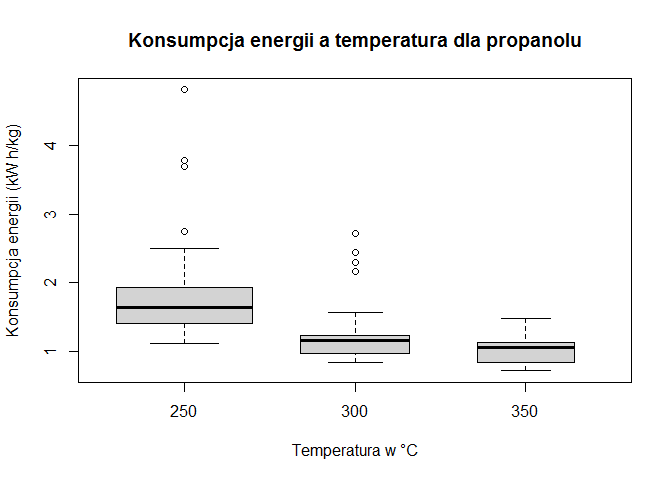
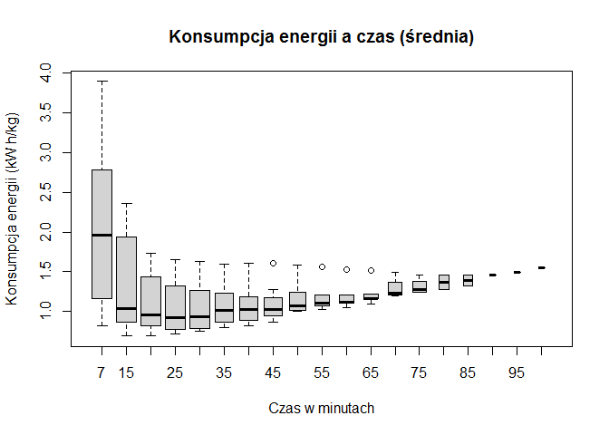
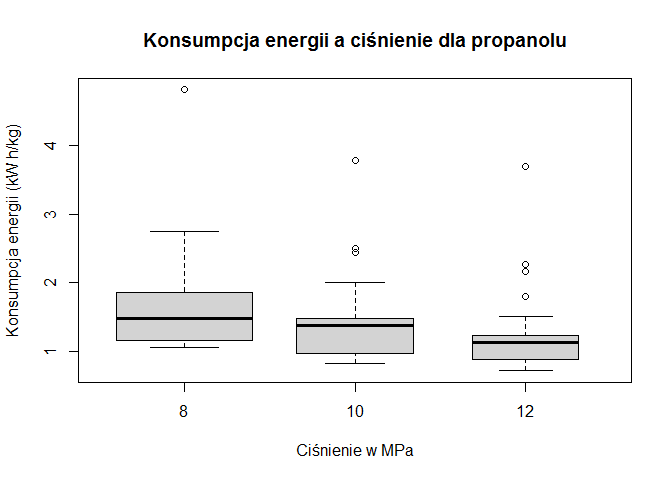
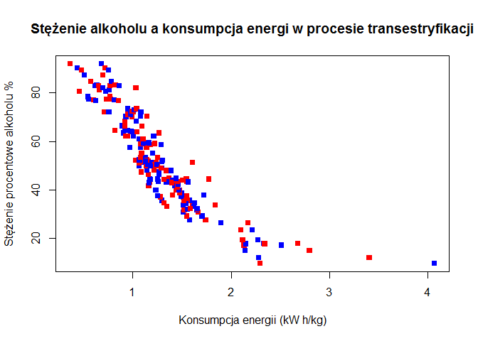

## 1. Zrozumienie uwarunkowań biznesowych

### 1.1 Biodiesel

Biodiesel jest paliwem odnawialnym wytwarzanym głównie w drodze transestryfikacji olejów i tłuszczów, które mogą być wykorzystywane jako paliwo transportowe, rozpuszczalnik i do wytwarzania energii, co może zmniejszyć emisje CO2, SO2, CO i HC w porównaniu z paliwami kopalnymi.

W przemyśle stosuje się również mieszanki paliwowe z olejem napędowym w celu otrzymania paliwa zapewniającego lepsze warunki pracy silnika. 

Biopaliwa stwarzają ogromne możliwości dla rozwoju gospodarki oraz aktywizację terenów wiejskich i zagospodarowanie nieużytków rolnych. Pozwalają na częściowe uniezależnienie energetyczne kraju od dostaw ropy oraz zmniejszenie zależności cen paliwa od zmian ceny ropy naftowej i kursów walut. 

Poza argumentami gospodarczymi możemy dostrzec pozytywny wpływ na środowisko.
Część wyemitowanego w trakcie spalania dwutlenku węgla została wcześniej wchłonięta przez rośliny, a w przypadku ON pochodzi on z ropy naftowej, w związku z tym wprowadza się mniejsze ilości dodatkowego CO2 do atmosfery.
Spalanie biopaliw nie zanieczyszcza powietrza związkami siarki, choć tutaj warto wspomnieć że powoduje emisję o około 20% więcej tlenków azotu.

Obecnie paliwo to zyskuje na popularności, w krajach Unii Europejskiej produkcja tego biopaliwa wzrasta o 20% rocznie.
Postęp technologiczny w tej dziedzinie obniża koszty produkcji przez co cena biodiesla jest porównywalna do ceny zwykłego diesla. 
Polityka proekologiczna prowadzona przez wiele państw promuje wykorzystanie odnawialnych źródeł energii, biopaliw i hybryd.
Dyrektywa europejska z 2003 roku narzuca państwom członkowskim UE wprowadzenie podatkowej promocji biopaliw. Wdrażanie jej postanowień do prawa w Polsce to m.in. zwolnienia od podatku akcyzowego .

### 1.2 Transestryfikacja nadkrytyczna

Jedną z alternatywnych metod produkcji biodiesla jest transestryfikacja nadkrytyczna.
Metoda transestryfikacji ta jest wolna od katalizatora i wykorzystuje nadkrytyczny metanol w wysokich temperaturach i ciśnieniach w procesie ciągłym. W stanie nadkrytycznym olej i metanol są w jednej fazie, a reakcja zachodzi spontanicznie i szybko. Proces może tolerować wodę w surowcu, wolne kwasy tłuszczowe są przekształcane w estry metylowe zamiast mydła, więc można stosować wiele różnych surowców. Eliminowany jest również etap usuwania katalizatora. Wymagane są wysokie temperatury i ciśnienia, ale koszty energii związane z produkcją są podobne lub mniejsze niż katalitycznych metod produkcyjnych.

### 1.3 Cel analizy

Celem poniższej analizy jest stworzenie modelu procesu krytycznej transestryfikacji który można  wykorzystać do symulacji i optymalizacji procesów produkcji biodiesla.
Analiza prowadzona jest zgodnie z metodyką CRISP-DM.


## 2. Zrozumienie danych

Otrzymane dane to wyniki pomiaru w procesie transestryfikacji.
Doświadczenia z transestryfikacją oleju rzepakowego w alkoholach nadkrytycznych (metanol, etanol i 1-propanol) prowadzono w reaktorze wsadowym w różnych temperaturach reakcji (250-350 ° C), ciśnieniu roboczym (8-12 MPa), czasie reakcji i stałym stosuneku molowym alkoholu do oleju wynoszącym 42:1. 

W pliku z wynikami doświadczenia zarejestrowano 105 pomiarów o ponizszych parametrach: 

* run_id - numer pomiaru

* b_temp - temperatura w czasie reakcji

* b_press - ciśnienie w czas reakcji

* b_time - czas reakcji

* meth_pct - stężenie metanolu

* meth_ec - konsumpcja energii dla metanolu 

* eth_pct - stężenie etanolu

* eth_ec - konsumpcja energii dla etanolu

* prop1_pct - stężenie propanol-1

* prop1_ec - konsumpcja energii dla propanol-1


### 2.1 Wizualizacja danych


```r
plot_ly(data = df, x = df$meth_pct, y = df$meth_ec, name = 'metanol', type = 'scatter', mode = 'markers',  text = ~paste("Stężenie alkoholu: ", df$meth_pct, ' %<br>Konsumpcja energii:', df$meth_ec)) %>%
  add_trace(y = df$eth_ec, name = 'etanol', mode = 'markers', text = ~paste("Stężenie alkoholu: ", df$eth_pct, ' %<br>Konsumpcja energii:', df$eth_ec)) %>%
  add_trace(y = df$prop1_ec, name = 'propanol', mode = 'markers', text = ~paste("Stężenie alkoholu: ", df$prop1_pct, ' %<br>Konsumpcja energii:', df$prop1_ec)
)
```

<!--html_preserve--><div id="htmlwidget-34a8521edbdf031e6aa1" style="width:672px;height:480px;" class="plotly html-widget"></div>
<script type="application/json" data-for="htmlwidget-34a8521edbdf031e6aa1">{"x":{"visdat":{"23884ac87db2":["function () ","plotlyVisDat"]},"cur_data":"23884ac87db2","attrs":{"23884ac87db2":{"x":[73.4,76.5,78.8,80.9,82.2,83.1,84.3,84.9,84.1,83.9,82.9,82.6,76.1,87.5,90.5,89.1,87.2,87,86.5,84.3,92.2,93,92.2,91.5,89.9,28.8,50.6,53.2,57.6,60.7,61.3,61.7,62.3,62.8,64.1,63.2,63,62.8,61,36.4,65.6,67.7,71.2,74,72.2,72,71.9,70.8,40.1,68.4,74.3,82.9,81.1,80.9,80.1,79.5,13.8,26.7,30.7,33.2,35.9,36.4,37.6,38.2,39.6,41.2,44.2,46.2,48.3,49.9,51.9,50.9,50.1,49.6,48.6,14.9,29.5,34,35.1,38.8,43.2,46.5,47.6,48.7,53.4,55,52.9,52.6,52,51.6,51.1,17.7,33.8,37.5,38.7,40.3,44.1,48.8,53.6,56.1,53.6,53.2,52.9,52.5,52],"y":[0.743,0.758,0.759,0.766,0.783,0.801,0.815,0.834,0.868,0.898,0.932,0.948,0.73,0.674,0.672,0.707,0.75,0.793,0.836,0.88,0.612,0.643,0.669,0.698,0.737,1.64,0.991,0.976,0.933,0.915,0.936,0.959,0.979,1,1.008,1.051,1.094,1.137,1.18,1.324,0.779,0.782,0.769,0.764,0.808,0.852,0.897,0.941,1.223,0.76,0.724,0.671,0.708,0.745,0.782,0.82,2.816,1.545,1.392,1.332,1.273,1.297,1.295,1.314,1.305,1.29,1.236,1.215,1.193,1.185,1.168,1.22,1.272,1.324,1.377,2.675,1.432,1.286,1.288,1.204,1.116,1.069,1.075,1.082,1.014,1.012,1.08,1.148,1.217,1.22,1.272,2.3,1.275,1.189,1.19,1.18,1.112,1.036,0.971,0.954,1.026,1.099,1.171,1.243,1.315],"mode":"markers","text":{},"name":"metanol","alpha_stroke":1,"sizes":[10,100],"spans":[1,20],"type":"scatter"},"23884ac87db2.1":{"x":[73.4,76.5,78.8,80.9,82.2,83.1,84.3,84.9,84.1,83.9,82.9,82.6,76.1,87.5,90.5,89.1,87.2,87,86.5,84.3,92.2,93,92.2,91.5,89.9,28.8,50.6,53.2,57.6,60.7,61.3,61.7,62.3,62.8,64.1,63.2,63,62.8,61,36.4,65.6,67.7,71.2,74,72.2,72,71.9,70.8,40.1,68.4,74.3,82.9,81.1,80.9,80.1,79.5,13.8,26.7,30.7,33.2,35.9,36.4,37.6,38.2,39.6,41.2,44.2,46.2,48.3,49.9,51.9,50.9,50.1,49.6,48.6,14.9,29.5,34,35.1,38.8,43.2,46.5,47.6,48.7,53.4,55,52.9,52.6,52,51.6,51.1,17.7,33.8,37.5,38.7,40.3,44.1,48.8,53.6,56.1,53.6,53.2,52.9,52.5,52],"y":[1.252,0.95,0.919,0.923,0.933,0.953,0.981,0.995,1.015,1.041,1.085,1.144,1.103,0.776,0.762,0.773,0.785,0.825,0.866,1.034,0.906,0.698,0.682,0.72,0.753,2.679,1.517,1.404,1.264,1.098,1.097,1.092,1.08,1.085,1.111,1.107,1.168,1.228,1.289,2.103,1.174,1.033,0.971,0.928,0.923,0.923,0.983,1.043,1.896,0.822,0.76,0.732,0.725,0.769,0.813,0.858,4.068,2.798,1.579,1.549,1.517,1.525,1.558,1.585,1.54,1.521,1.492,1.477,1.469,1.459,1.463,1.457,1.445,1.505,1.565,3.405,2.514,1.347,1.298,1.286,1.236,1.173,1.178,1.159,1.144,1.14,1.156,1.144,1.133,1.24,1.248,2.343,2.273,1.317,1.255,1.164,1.167,1.09,1.067,1.067,1.071,1.081,1.184,1.288,1.392],"mode":"markers","text":{},"name":"etanol","alpha_stroke":1,"sizes":[10,100],"spans":[1,20],"type":"scatter","inherit":true},"23884ac87db2.2":{"x":[73.4,76.5,78.8,80.9,82.2,83.1,84.3,84.9,84.1,83.9,82.9,82.6,76.1,87.5,90.5,89.1,87.2,87,86.5,84.3,92.2,93,92.2,91.5,89.9,28.8,50.6,53.2,57.6,60.7,61.3,61.7,62.3,62.8,64.1,63.2,63,62.8,61,36.4,65.6,67.7,71.2,74,72.2,72,71.9,70.8,40.1,68.4,74.3,82.9,81.1,80.9,80.1,79.5,13.8,26.7,30.7,33.2,35.9,36.4,37.6,38.2,39.6,41.2,44.2,46.2,48.3,49.9,51.9,50.9,50.1,49.6,48.6,14.9,29.5,34,35.1,38.8,43.2,46.5,47.6,48.7,53.4,55,52.9,52.6,52,51.6,51.1,17.7,33.8,37.5,38.7,40.3,44.1,48.8,53.6,56.1,53.6,53.2,52.9,52.5,52],"y":[1.477,1.107,1.081,1.069,1.083,1.111,1.139,1.165,1.149,1.124,1.13,1.177,1.332,0.86,0.824,0.841,0.84,0.854,0.861,0.915,0.953,0.733,0.73,0.723,0.764,2.724,2.303,1.576,1.326,1.193,1.161,1.158,1.174,1.202,1.189,1.209,1.228,1.243,1.281,2.448,1.143,1.072,0.988,0.946,0.971,0.968,0.981,1.027,2.167,1.015,0.99,0.916,0.849,0.864,0.872,0.935,4.803,2.743,2.22,2.074,2.104,1.976,1.972,1.939,1.909,1.861,1.868,1.849,1.827,1.748,1.735,1.696,1.66,1.64,1.724,3.783,2.499,2.006,1.61,1.482,1.505,1.541,1.576,1.483,1.471,1.464,1.415,1.38,1.386,1.382,1.45,3.691,2.261,1.801,1.513,1.463,1.261,1.196,1.123,1.129,1.129,1.132,1.145,1.161,1.198],"mode":"markers","text":{},"name":"propanol","alpha_stroke":1,"sizes":[10,100],"spans":[1,20],"type":"scatter","inherit":true}},"layout":{"margin":{"b":40,"l":60,"t":25,"r":10},"xaxis":{"domain":[0,1],"automargin":true,"title":[]},"yaxis":{"domain":[0,1],"automargin":true,"title":[]},"hovermode":"closest","showlegend":true},"source":"A","config":{"modeBarButtonsToAdd":[{"name":"Collaborate","icon":{"width":1000,"ascent":500,"descent":-50,"path":"M487 375c7-10 9-23 5-36l-79-259c-3-12-11-23-22-31-11-8-22-12-35-12l-263 0c-15 0-29 5-43 15-13 10-23 23-28 37-5 13-5 25-1 37 0 0 0 3 1 7 1 5 1 8 1 11 0 2 0 4-1 6 0 3-1 5-1 6 1 2 2 4 3 6 1 2 2 4 4 6 2 3 4 5 5 7 5 7 9 16 13 26 4 10 7 19 9 26 0 2 0 5 0 9-1 4-1 6 0 8 0 2 2 5 4 8 3 3 5 5 5 7 4 6 8 15 12 26 4 11 7 19 7 26 1 1 0 4 0 9-1 4-1 7 0 8 1 2 3 5 6 8 4 4 6 6 6 7 4 5 8 13 13 24 4 11 7 20 7 28 1 1 0 4 0 7-1 3-1 6-1 7 0 2 1 4 3 6 1 1 3 4 5 6 2 3 3 5 5 6 1 2 3 5 4 9 2 3 3 7 5 10 1 3 2 6 4 10 2 4 4 7 6 9 2 3 4 5 7 7 3 2 7 3 11 3 3 0 8 0 13-1l0-1c7 2 12 2 14 2l218 0c14 0 25-5 32-16 8-10 10-23 6-37l-79-259c-7-22-13-37-20-43-7-7-19-10-37-10l-248 0c-5 0-9-2-11-5-2-3-2-7 0-12 4-13 18-20 41-20l264 0c5 0 10 2 16 5 5 3 8 6 10 11l85 282c2 5 2 10 2 17 7-3 13-7 17-13z m-304 0c-1-3-1-5 0-7 1-1 3-2 6-2l174 0c2 0 4 1 7 2 2 2 4 4 5 7l6 18c0 3 0 5-1 7-1 1-3 2-6 2l-173 0c-3 0-5-1-8-2-2-2-4-4-4-7z m-24-73c-1-3-1-5 0-7 2-2 3-2 6-2l174 0c2 0 5 0 7 2 3 2 4 4 5 7l6 18c1 2 0 5-1 6-1 2-3 3-5 3l-174 0c-3 0-5-1-7-3-3-1-4-4-5-6z"},"click":"function(gd) { \n        // is this being viewed in RStudio?\n        if (location.search == '?viewer_pane=1') {\n          alert('To learn about plotly for collaboration, visit:\\n https://cpsievert.github.io/plotly_book/plot-ly-for-collaboration.html');\n        } else {\n          window.open('https://cpsievert.github.io/plotly_book/plot-ly-for-collaboration.html', '_blank');\n        }\n      }"}],"cloud":false},"data":[{"x":[73.4,76.5,78.8,80.9,82.2,83.1,84.3,84.9,84.1,83.9,82.9,82.6,76.1,87.5,90.5,89.1,87.2,87,86.5,84.3,92.2,93,92.2,91.5,89.9,28.8,50.6,53.2,57.6,60.7,61.3,61.7,62.3,62.8,64.1,63.2,63,62.8,61,36.4,65.6,67.7,71.2,74,72.2,72,71.9,70.8,40.1,68.4,74.3,82.9,81.1,80.9,80.1,79.5,13.8,26.7,30.7,33.2,35.9,36.4,37.6,38.2,39.6,41.2,44.2,46.2,48.3,49.9,51.9,50.9,50.1,49.6,48.6,14.9,29.5,34,35.1,38.8,43.2,46.5,47.6,48.7,53.4,55,52.9,52.6,52,51.6,51.1,17.7,33.8,37.5,38.7,40.3,44.1,48.8,53.6,56.1,53.6,53.2,52.9,52.5,52],"y":[0.743,0.758,0.759,0.766,0.783,0.801,0.815,0.834,0.868,0.898,0.932,0.948,0.73,0.674,0.672,0.707,0.75,0.793,0.836,0.88,0.612,0.643,0.669,0.698,0.737,1.64,0.991,0.976,0.933,0.915,0.936,0.959,0.979,1,1.008,1.051,1.094,1.137,1.18,1.324,0.779,0.782,0.769,0.764,0.808,0.852,0.897,0.941,1.223,0.76,0.724,0.671,0.708,0.745,0.782,0.82,2.816,1.545,1.392,1.332,1.273,1.297,1.295,1.314,1.305,1.29,1.236,1.215,1.193,1.185,1.168,1.22,1.272,1.324,1.377,2.675,1.432,1.286,1.288,1.204,1.116,1.069,1.075,1.082,1.014,1.012,1.08,1.148,1.217,1.22,1.272,2.3,1.275,1.189,1.19,1.18,1.112,1.036,0.971,0.954,1.026,1.099,1.171,1.243,1.315],"mode":"markers","text":["Stężenie alkoholu:  73.4  %<br>Konsumpcja energii: 0.743","Stężenie alkoholu:  76.5  %<br>Konsumpcja energii: 0.758","Stężenie alkoholu:  78.8  %<br>Konsumpcja energii: 0.759","Stężenie alkoholu:  80.9  %<br>Konsumpcja energii: 0.766","Stężenie alkoholu:  82.2  %<br>Konsumpcja energii: 0.783","Stężenie alkoholu:  83.1  %<br>Konsumpcja energii: 0.801","Stężenie alkoholu:  84.3  %<br>Konsumpcja energii: 0.815","Stężenie alkoholu:  84.9  %<br>Konsumpcja energii: 0.834","Stężenie alkoholu:  84.1  %<br>Konsumpcja energii: 0.868","Stężenie alkoholu:  83.9  %<br>Konsumpcja energii: 0.898","Stężenie alkoholu:  82.9  %<br>Konsumpcja energii: 0.932","Stężenie alkoholu:  82.6  %<br>Konsumpcja energii: 0.948","Stężenie alkoholu:  76.1  %<br>Konsumpcja energii: 0.73","Stężenie alkoholu:  87.5  %<br>Konsumpcja energii: 0.674","Stężenie alkoholu:  90.5  %<br>Konsumpcja energii: 0.672","Stężenie alkoholu:  89.1  %<br>Konsumpcja energii: 0.707","Stężenie alkoholu:  87.2  %<br>Konsumpcja energii: 0.75","Stężenie alkoholu:  87  %<br>Konsumpcja energii: 0.793","Stężenie alkoholu:  86.5  %<br>Konsumpcja energii: 0.836","Stężenie alkoholu:  84.3  %<br>Konsumpcja energii: 0.88","Stężenie alkoholu:  92.2  %<br>Konsumpcja energii: 0.612","Stężenie alkoholu:  93  %<br>Konsumpcja energii: 0.643","Stężenie alkoholu:  92.2  %<br>Konsumpcja energii: 0.669","Stężenie alkoholu:  91.5  %<br>Konsumpcja energii: 0.698","Stężenie alkoholu:  89.9  %<br>Konsumpcja energii: 0.737","Stężenie alkoholu:  28.8  %<br>Konsumpcja energii: 1.64","Stężenie alkoholu:  50.6  %<br>Konsumpcja energii: 0.991","Stężenie alkoholu:  53.2  %<br>Konsumpcja energii: 0.976","Stężenie alkoholu:  57.6  %<br>Konsumpcja energii: 0.933","Stężenie alkoholu:  60.7  %<br>Konsumpcja energii: 0.915","Stężenie alkoholu:  61.3  %<br>Konsumpcja energii: 0.936","Stężenie alkoholu:  61.7  %<br>Konsumpcja energii: 0.959","Stężenie alkoholu:  62.3  %<br>Konsumpcja energii: 0.979","Stężenie alkoholu:  62.8  %<br>Konsumpcja energii: 1","Stężenie alkoholu:  64.1  %<br>Konsumpcja energii: 1.008","Stężenie alkoholu:  63.2  %<br>Konsumpcja energii: 1.051","Stężenie alkoholu:  63  %<br>Konsumpcja energii: 1.094","Stężenie alkoholu:  62.8  %<br>Konsumpcja energii: 1.137","Stężenie alkoholu:  61  %<br>Konsumpcja energii: 1.18","Stężenie alkoholu:  36.4  %<br>Konsumpcja energii: 1.324","Stężenie alkoholu:  65.6  %<br>Konsumpcja energii: 0.779","Stężenie alkoholu:  67.7  %<br>Konsumpcja energii: 0.782","Stężenie alkoholu:  71.2  %<br>Konsumpcja energii: 0.769","Stężenie alkoholu:  74  %<br>Konsumpcja energii: 0.764","Stężenie alkoholu:  72.2  %<br>Konsumpcja energii: 0.808","Stężenie alkoholu:  72  %<br>Konsumpcja energii: 0.852","Stężenie alkoholu:  71.9  %<br>Konsumpcja energii: 0.897","Stężenie alkoholu:  70.8  %<br>Konsumpcja energii: 0.941","Stężenie alkoholu:  40.1  %<br>Konsumpcja energii: 1.223","Stężenie alkoholu:  68.4  %<br>Konsumpcja energii: 0.76","Stężenie alkoholu:  74.3  %<br>Konsumpcja energii: 0.724","Stężenie alkoholu:  82.9  %<br>Konsumpcja energii: 0.671","Stężenie alkoholu:  81.1  %<br>Konsumpcja energii: 0.708","Stężenie alkoholu:  80.9  %<br>Konsumpcja energii: 0.745","Stężenie alkoholu:  80.1  %<br>Konsumpcja energii: 0.782","Stężenie alkoholu:  79.5  %<br>Konsumpcja energii: 0.82","Stężenie alkoholu:  13.8  %<br>Konsumpcja energii: 2.816","Stężenie alkoholu:  26.7  %<br>Konsumpcja energii: 1.545","Stężenie alkoholu:  30.7  %<br>Konsumpcja energii: 1.392","Stężenie alkoholu:  33.2  %<br>Konsumpcja energii: 1.332","Stężenie alkoholu:  35.9  %<br>Konsumpcja energii: 1.273","Stężenie alkoholu:  36.4  %<br>Konsumpcja energii: 1.297","Stężenie alkoholu:  37.6  %<br>Konsumpcja energii: 1.295","Stężenie alkoholu:  38.2  %<br>Konsumpcja energii: 1.314","Stężenie alkoholu:  39.6  %<br>Konsumpcja energii: 1.305","Stężenie alkoholu:  41.2  %<br>Konsumpcja energii: 1.29","Stężenie alkoholu:  44.2  %<br>Konsumpcja energii: 1.236","Stężenie alkoholu:  46.2  %<br>Konsumpcja energii: 1.215","Stężenie alkoholu:  48.3  %<br>Konsumpcja energii: 1.193","Stężenie alkoholu:  49.9  %<br>Konsumpcja energii: 1.185","Stężenie alkoholu:  51.9  %<br>Konsumpcja energii: 1.168","Stężenie alkoholu:  50.9  %<br>Konsumpcja energii: 1.22","Stężenie alkoholu:  50.1  %<br>Konsumpcja energii: 1.272","Stężenie alkoholu:  49.6  %<br>Konsumpcja energii: 1.324","Stężenie alkoholu:  48.6  %<br>Konsumpcja energii: 1.377","Stężenie alkoholu:  14.9  %<br>Konsumpcja energii: 2.675","Stężenie alkoholu:  29.5  %<br>Konsumpcja energii: 1.432","Stężenie alkoholu:  34  %<br>Konsumpcja energii: 1.286","Stężenie alkoholu:  35.1  %<br>Konsumpcja energii: 1.288","Stężenie alkoholu:  38.8  %<br>Konsumpcja energii: 1.204","Stężenie alkoholu:  43.2  %<br>Konsumpcja energii: 1.116","Stężenie alkoholu:  46.5  %<br>Konsumpcja energii: 1.069","Stężenie alkoholu:  47.6  %<br>Konsumpcja energii: 1.075","Stężenie alkoholu:  48.7  %<br>Konsumpcja energii: 1.082","Stężenie alkoholu:  53.4  %<br>Konsumpcja energii: 1.014","Stężenie alkoholu:  55  %<br>Konsumpcja energii: 1.012","Stężenie alkoholu:  52.9  %<br>Konsumpcja energii: 1.08","Stężenie alkoholu:  52.6  %<br>Konsumpcja energii: 1.148","Stężenie alkoholu:  52  %<br>Konsumpcja energii: 1.217","Stężenie alkoholu:  51.6  %<br>Konsumpcja energii: 1.22","Stężenie alkoholu:  51.1  %<br>Konsumpcja energii: 1.272","Stężenie alkoholu:  17.7  %<br>Konsumpcja energii: 2.3","Stężenie alkoholu:  33.8  %<br>Konsumpcja energii: 1.275","Stężenie alkoholu:  37.5  %<br>Konsumpcja energii: 1.189","Stężenie alkoholu:  38.7  %<br>Konsumpcja energii: 1.19","Stężenie alkoholu:  40.3  %<br>Konsumpcja energii: 1.18","Stężenie alkoholu:  44.1  %<br>Konsumpcja energii: 1.112","Stężenie alkoholu:  48.8  %<br>Konsumpcja energii: 1.036","Stężenie alkoholu:  53.6  %<br>Konsumpcja energii: 0.971","Stężenie alkoholu:  56.1  %<br>Konsumpcja energii: 0.954","Stężenie alkoholu:  53.6  %<br>Konsumpcja energii: 1.026","Stężenie alkoholu:  53.2  %<br>Konsumpcja energii: 1.099","Stężenie alkoholu:  52.9  %<br>Konsumpcja energii: 1.171","Stężenie alkoholu:  52.5  %<br>Konsumpcja energii: 1.243","Stężenie alkoholu:  52  %<br>Konsumpcja energii: 1.315"],"name":"metanol","type":"scatter","marker":{"color":"rgba(31,119,180,1)","line":{"color":"rgba(31,119,180,1)"}},"error_y":{"color":"rgba(31,119,180,1)"},"error_x":{"color":"rgba(31,119,180,1)"},"line":{"color":"rgba(31,119,180,1)"},"xaxis":"x","yaxis":"y","frame":null},{"x":[73.4,76.5,78.8,80.9,82.2,83.1,84.3,84.9,84.1,83.9,82.9,82.6,76.1,87.5,90.5,89.1,87.2,87,86.5,84.3,92.2,93,92.2,91.5,89.9,28.8,50.6,53.2,57.6,60.7,61.3,61.7,62.3,62.8,64.1,63.2,63,62.8,61,36.4,65.6,67.7,71.2,74,72.2,72,71.9,70.8,40.1,68.4,74.3,82.9,81.1,80.9,80.1,79.5,13.8,26.7,30.7,33.2,35.9,36.4,37.6,38.2,39.6,41.2,44.2,46.2,48.3,49.9,51.9,50.9,50.1,49.6,48.6,14.9,29.5,34,35.1,38.8,43.2,46.5,47.6,48.7,53.4,55,52.9,52.6,52,51.6,51.1,17.7,33.8,37.5,38.7,40.3,44.1,48.8,53.6,56.1,53.6,53.2,52.9,52.5,52],"y":[1.252,0.95,0.919,0.923,0.933,0.953,0.981,0.995,1.015,1.041,1.085,1.144,1.103,0.776,0.762,0.773,0.785,0.825,0.866,1.034,0.906,0.698,0.682,0.72,0.753,2.679,1.517,1.404,1.264,1.098,1.097,1.092,1.08,1.085,1.111,1.107,1.168,1.228,1.289,2.103,1.174,1.033,0.971,0.928,0.923,0.923,0.983,1.043,1.896,0.822,0.76,0.732,0.725,0.769,0.813,0.858,4.068,2.798,1.579,1.549,1.517,1.525,1.558,1.585,1.54,1.521,1.492,1.477,1.469,1.459,1.463,1.457,1.445,1.505,1.565,3.405,2.514,1.347,1.298,1.286,1.236,1.173,1.178,1.159,1.144,1.14,1.156,1.144,1.133,1.24,1.248,2.343,2.273,1.317,1.255,1.164,1.167,1.09,1.067,1.067,1.071,1.081,1.184,1.288,1.392],"mode":"markers","text":["Stężenie alkoholu:  44.4  %<br>Konsumpcja energii: 1.252","Stężenie alkoholu:  62.1  %<br>Konsumpcja energii: 0.95","Stężenie alkoholu:  66.2  %<br>Konsumpcja energii: 0.919","Stężenie alkoholu:  68.3  %<br>Konsumpcja energii: 0.923","Stężenie alkoholu:  70.1  %<br>Konsumpcja energii: 0.933","Stężenie alkoholu:  70.9  %<br>Konsumpcja energii: 0.953","Stężenie alkoholu:  71.1  %<br>Konsumpcja energii: 0.981","Stężenie alkoholu:  72.2  %<br>Konsumpcja energii: 0.995","Stężenie alkoholu:  72.9  %<br>Konsumpcja energii: 1.015","Stężenie alkoholu:  73.3  %<br>Konsumpcja energii: 1.041","Stężenie alkoholu:  72.1  %<br>Konsumpcja energii: 1.085","Stężenie alkoholu:  70.2  %<br>Konsumpcja energii: 1.144","Stężenie alkoholu:  51.3  %<br>Konsumpcja energii: 1.103","Stężenie alkoholu:  77.3  %<br>Konsumpcja energii: 0.776","Stężenie alkoholu:  81.1  %<br>Konsumpcja energii: 0.762","Stężenie alkoholu:  82.8  %<br>Konsumpcja energii: 0.773","Stężenie alkoholu:  84.6  %<br>Konsumpcja energii: 0.785","Stężenie alkoholu:  83.1  %<br>Konsumpcja energii: 0.825","Stężenie alkoholu:  82.9  %<br>Konsumpcja energii: 0.866","Stężenie alkoholu:  82  %<br>Konsumpcja energii: 1.034","Stężenie alkoholu:  63.4  %<br>Konsumpcja energii: 0.906","Stężenie alkoholu:  87.1  %<br>Konsumpcja energii: 0.698","Stężenie alkoholu:  91.9  %<br>Konsumpcja energii: 0.682","Stężenie alkoholu:  90.1  %<br>Konsumpcja energii: 0.72","Stężenie alkoholu:  89.3  %<br>Konsumpcja energii: 0.753","Stężenie alkoholu:  18  %<br>Konsumpcja energii: 2.679","Stężenie alkoholu:  33.7  %<br>Konsumpcja energii: 1.517","Stężenie alkoholu:  37.7  %<br>Konsumpcja energii: 1.404","Stężenie alkoholu:  43.3  %<br>Konsumpcja energii: 1.264","Stężenie alkoholu:  51.5  %<br>Konsumpcja energii: 1.098","Stężenie alkoholu:  53.2  %<br>Konsumpcja energii: 1.097","Stężenie alkoholu:  55.1  %<br>Konsumpcja energii: 1.092","Stężenie alkoholu:  57.4  %<br>Konsumpcja energii: 1.08","Stężenie alkoholu:  58.8  %<br>Konsumpcja energii: 1.085","Stężenie alkoholu:  59.1  %<br>Konsumpcja energii: 1.111","Stężenie alkoholu:  60.9  %<br>Konsumpcja energii: 1.107","Stężenie alkoholu:  59.3  %<br>Konsumpcja energii: 1.168","Stężenie alkoholu:  59  %<br>Konsumpcja energii: 1.228","Stężenie alkoholu:  58.5  %<br>Konsumpcja energii: 1.289","Stężenie alkoholu:  23.4  %<br>Konsumpcja energii: 2.103","Stężenie alkoholu:  44.4  %<br>Konsumpcja energii: 1.174","Stężenie alkoholu:  52.2  %<br>Konsumpcja energii: 1.033","Stężenie alkoholu:  57.4  %<br>Konsumpcja energii: 0.971","Stężenie alkoholu:  62  %<br>Konsumpcja energii: 0.928","Stężenie alkoholu:  64.3  %<br>Konsumpcja energii: 0.923","Stężenie alkoholu:  66.3  %<br>Konsumpcja energii: 0.923","Stężenie alkoholu:  64.1  %<br>Konsumpcja energii: 0.983","Stężenie alkoholu:  63.9  %<br>Konsumpcja energii: 1.043","Stężenie alkoholu:  26.4  %<br>Konsumpcja energii: 1.896","Stężenie alkoholu:  64.4  %<br>Konsumpcja energii: 0.822","Stężenie alkoholu:  72.1  %<br>Konsumpcja energii: 0.76","Stężenie alkoholu:  77.3  %<br>Konsumpcja energii: 0.732","Stężenie alkoholu:  80.6  %<br>Konsumpcja energii: 0.725","Stężenie alkoholu:  78.3  %<br>Konsumpcja energii: 0.769","Stężenie alkoholu:  76.9  %<br>Konsumpcja energii: 0.813","Stężenie alkoholu:  76.6  %<br>Konsumpcja energii: 0.858","Stężenie alkoholu:  9.8  %<br>Konsumpcja energii: 4.068","Stężenie alkoholu:  15.1  %<br>Konsumpcja energii: 2.798","Stężenie alkoholu:  27.7  %<br>Konsumpcja energii: 1.579","Stężenie alkoholu:  29.2  %<br>Konsumpcja energii: 1.549","Stężenie alkoholu:  30.8  %<br>Konsumpcja energii: 1.517","Stężenie alkoholu:  31.6  %<br>Konsumpcja energii: 1.525","Stężenie alkoholu:  31.9  %<br>Konsumpcja energii: 1.558","Stężenie alkoholu:  32.3  %<br>Konsumpcja energii: 1.585","Stężenie alkoholu:  34.2  %<br>Konsumpcja energii: 1.54","Stężenie alkoholu:  35.6  %<br>Konsumpcja energii: 1.521","Stężenie alkoholu:  37.3  %<br>Konsumpcja energii: 1.492","Stężenie alkoholu:  38.7  %<br>Konsumpcja energii: 1.477","Stężenie alkoholu:  39.9  %<br>Konsumpcja energii: 1.469","Stężenie alkoholu:  41.2  %<br>Konsumpcja energii: 1.459","Stężenie alkoholu:  42.1  %<br>Konsumpcja energii: 1.463","Stężenie alkoholu:  43.3  %<br>Konsumpcja energii: 1.457","Stężenie alkoholu:  44.7  %<br>Konsumpcja energii: 1.445","Stężenie alkoholu:  43.9  %<br>Konsumpcja energii: 1.505","Stężenie alkoholu:  43.2  %<br>Konsumpcja energii: 1.565","Stężenie alkoholu:  12  %<br>Konsumpcja energii: 3.405","Stężenie alkoholu:  17.2  %<br>Konsumpcja energii: 2.514","Stężenie alkoholu:  33.2  %<br>Konsumpcja energii: 1.347","Stężenie alkoholu:  35.6  %<br>Konsumpcja energii: 1.298","Stężenie alkoholu:  37.1  %<br>Konsumpcja energii: 1.286","Stężenie alkoholu:  39.8  %<br>Konsumpcja energii: 1.236","Stężenie alkoholu:  43.2  %<br>Konsumpcja energii: 1.173","Stężenie alkoholu:  44.3  %<br>Konsumpcja energii: 1.178","Stężenie alkoholu:  46.3  %<br>Konsumpcja energii: 1.159","Stężenie alkoholu:  48.2  %<br>Konsumpcja energii: 1.144","Stężenie alkoholu:  49.7  %<br>Konsumpcja energii: 1.14","Stężenie alkoholu:  50.3  %<br>Konsumpcja energii: 1.156","Stężenie alkoholu:  52.1  %<br>Konsumpcja energii: 1.144","Stężenie alkoholu:  51.7  %<br>Konsumpcja energii: 1.133","Stężenie alkoholu:  51.2  %<br>Konsumpcja energii: 1.24","Stężenie alkoholu:  50.4  %<br>Konsumpcja energii: 1.248","Stężenie alkoholu:  17.8  %<br>Konsumpcja energii: 2.343","Stężenie alkoholu:  19.4  %<br>Konsumpcja energii: 2.273","Stężenie alkoholu:  34.6  %<br>Konsumpcja energii: 1.317","Stężenie alkoholu:  37.5  %<br>Konsumpcja energii: 1.255","Stężenie alkoholu:  41.7  %<br>Konsumpcja energii: 1.164","Stężenie alkoholu:  42.9  %<br>Konsumpcja energii: 1.167","Stężenie alkoholu:  47.3  %<br>Konsumpcja energii: 1.09","Stężenie alkoholu:  49.7  %<br>Konsumpcja energii: 1.067","Stężenie alkoholu:  51.1  %<br>Konsumpcja energii: 1.067","Stężenie alkoholu:  52.3  %<br>Konsumpcja energii: 1.071","Stężenie alkoholu:  53.2  %<br>Konsumpcja energii: 1.081","Stężenie alkoholu:  49.8  %<br>Konsumpcja energii: 1.184","Stężenie alkoholu:  48.9  %<br>Konsumpcja energii: 1.288","Stężenie alkoholu:  47.9  %<br>Konsumpcja energii: 1.392"],"name":"etanol","type":"scatter","marker":{"color":"rgba(255,127,14,1)","line":{"color":"rgba(255,127,14,1)"}},"error_y":{"color":"rgba(255,127,14,1)"},"error_x":{"color":"rgba(255,127,14,1)"},"line":{"color":"rgba(255,127,14,1)"},"xaxis":"x","yaxis":"y","frame":null},{"x":[73.4,76.5,78.8,80.9,82.2,83.1,84.3,84.9,84.1,83.9,82.9,82.6,76.1,87.5,90.5,89.1,87.2,87,86.5,84.3,92.2,93,92.2,91.5,89.9,28.8,50.6,53.2,57.6,60.7,61.3,61.7,62.3,62.8,64.1,63.2,63,62.8,61,36.4,65.6,67.7,71.2,74,72.2,72,71.9,70.8,40.1,68.4,74.3,82.9,81.1,80.9,80.1,79.5,13.8,26.7,30.7,33.2,35.9,36.4,37.6,38.2,39.6,41.2,44.2,46.2,48.3,49.9,51.9,50.9,50.1,49.6,48.6,14.9,29.5,34,35.1,38.8,43.2,46.5,47.6,48.7,53.4,55,52.9,52.6,52,51.6,51.1,17.7,33.8,37.5,38.7,40.3,44.1,48.8,53.6,56.1,53.6,53.2,52.9,52.5,52],"y":[1.477,1.107,1.081,1.069,1.083,1.111,1.139,1.165,1.149,1.124,1.13,1.177,1.332,0.86,0.824,0.841,0.84,0.854,0.861,0.915,0.953,0.733,0.73,0.723,0.764,2.724,2.303,1.576,1.326,1.193,1.161,1.158,1.174,1.202,1.189,1.209,1.228,1.243,1.281,2.448,1.143,1.072,0.988,0.946,0.971,0.968,0.981,1.027,2.167,1.015,0.99,0.916,0.849,0.864,0.872,0.935,4.803,2.743,2.22,2.074,2.104,1.976,1.972,1.939,1.909,1.861,1.868,1.849,1.827,1.748,1.735,1.696,1.66,1.64,1.724,3.783,2.499,2.006,1.61,1.482,1.505,1.541,1.576,1.483,1.471,1.464,1.415,1.38,1.386,1.382,1.45,3.691,2.261,1.801,1.513,1.463,1.261,1.196,1.123,1.129,1.129,1.132,1.145,1.161,1.198],"mode":"markers","text":["Stężenie alkoholu:  38.3  %<br>Konsumpcja energii: 1.477","Stężenie alkoholu:  54.2  %<br>Konsumpcja energii: 1.107","Stężenie alkoholu:  57.2  %<br>Konsumpcja energii: 1.081","Stężenie alkoholu:  59.9  %<br>Konsumpcja energii: 1.069","Stężenie alkoholu:  61.3  %<br>Konsumpcja energii: 1.083","Stężenie alkoholu:  61.7  %<br>Konsumpcja energii: 1.111","Stężenie alkoholu:  62.1  %<br>Konsumpcja energii: 1.139","Stężenie alkoholu:  62.5  %<br>Konsumpcja energii: 1.165","Stężenie alkoholu:  65.3  %<br>Konsumpcja energii: 1.149","Stężenie alkoholu:  68.8  %<br>Konsumpcja energii: 1.124","Stężenie alkoholu:  70.1  %<br>Konsumpcja energii: 1.13","Stężenie alkoholu:  69.1  %<br>Konsumpcja energii: 1.177","Stężenie alkoholu:  43.2  %<br>Konsumpcja energii: 1.332","Stężenie alkoholu:  70.9  %<br>Konsumpcja energii: 0.86","Stężenie alkoholu:  76.2  %<br>Konsumpcja energii: 0.824","Stężenie alkoholu:  77.3  %<br>Konsumpcja energii: 0.841","Stężenie alkoholu:  80.2  %<br>Konsumpcja energii: 0.84","Stężenie alkoholu:  81.5  %<br>Konsumpcja energii: 0.854","Stężenie alkoholu:  83.3  %<br>Konsumpcja energii: 0.861","Stężenie alkoholu:  80.7  %<br>Konsumpcja energii: 0.915","Stężenie alkoholu:  61.3  %<br>Konsumpcja energii: 0.953","Stężenie alkoholu:  84.3  %<br>Konsumpcja energii: 0.733","Stężenie alkoholu:  87.2  %<br>Konsumpcja energii: 0.73","Stężenie alkoholu:  91.1  %<br>Konsumpcja energii: 0.723","Stężenie alkoholu:  89.3  %<br>Konsumpcja energii: 0.764","Stężenie alkoholu:  17.7  %<br>Konsumpcja energii: 2.724","Stężenie alkoholu:  22.2  %<br>Konsumpcja energii: 2.303","Stężenie alkoholu:  33.6  %<br>Konsumpcja energii: 1.576","Stężenie alkoholu:  41.3  %<br>Konsumpcja energii: 1.326","Stężenie alkoholu:  47.4  %<br>Konsumpcja energii: 1.193","Stężenie alkoholu:  50.3  %<br>Konsumpcja energii: 1.161","Stężenie alkoholu:  52  %<br>Konsumpcja energii: 1.158","Stężenie alkoholu:  52.8  %<br>Konsumpcja energii: 1.174","Stężenie alkoholu:  53.1  %<br>Konsumpcja energii: 1.202","Stężenie alkoholu:  55.2  %<br>Konsumpcja energii: 1.189","Stężenie alkoholu:  55.8  %<br>Konsumpcja energii: 1.209","Stężenie alkoholu:  56.4  %<br>Konsumpcja energii: 1.228","Stężenie alkoholu:  57.2  %<br>Konsumpcja energii: 1.243","Stężenie alkoholu:  56.9  %<br>Konsumpcja energii: 1.281","Stężenie alkoholu:  20.1  %<br>Konsumpcja energii: 2.448","Stężenie alkoholu:  45.6  %<br>Konsumpcja energii: 1.143","Stężenie alkoholu:  50.3  %<br>Konsumpcja energii: 1.072","Stężenie alkoholu:  56.4  %<br>Konsumpcja energii: 0.988","Stężenie alkoholu:  60.8  %<br>Konsumpcja energii: 0.946","Stężenie alkoholu:  61.1  %<br>Konsumpcja energii: 0.971","Stężenie alkoholu:  63.2  %<br>Konsumpcja energii: 0.968","Stężenie alkoholu:  64.2  %<br>Konsumpcja energii: 0.981","Stężenie alkoholu:  63.1  %<br>Konsumpcja energii: 1.027","Stężenie alkoholu:  23.1  %<br>Konsumpcja energii: 2.167","Stężenie alkoholu:  52.2  %<br>Konsumpcja energii: 1.015","Stężenie alkoholu:  55.3  %<br>Konsumpcja energii: 0.99","Stężenie alkoholu:  61.8  %<br>Konsumpcja energii: 0.916","Stężenie alkoholu:  68.8  %<br>Konsumpcja energii: 0.849","Stężenie alkoholu:  69.7  %<br>Konsumpcja energii: 0.864","Stężenie alkoholu:  71.1  %<br>Konsumpcja energii: 0.872","Stężenie alkoholu:  68.3  %<br>Konsumpcja energii: 0.935","Stężenie alkoholu:  8.3  %<br>Konsumpcja energii: 4.803","Stężenie alkoholu:  15.4  %<br>Konsumpcja energii: 2.743","Stężenie alkoholu:  19.7  %<br>Konsumpcja energii: 2.22","Stężenie alkoholu:  21.8  %<br>Konsumpcja energii: 2.074","Stężenie alkoholu:  22.2  %<br>Konsumpcja energii: 2.104","Stężenie alkoholu:  24.4  %<br>Konsumpcja energii: 1.976","Stężenie alkoholu:  25.2  %<br>Konsumpcja energii: 1.972","Stężenie alkoholu:  26.4  %<br>Konsumpcja energii: 1.939","Stężenie alkoholu:  27.6  %<br>Konsumpcja energii: 1.909","Stężenie alkoholu:  29.1  %<br>Konsumpcja energii: 1.861","Stężenie alkoholu:  29.8  %<br>Konsumpcja energii: 1.868","Stężenie alkoholu:  30.9  %<br>Konsumpcja energii: 1.849","Stężenie alkoholu:  32.1  %<br>Konsumpcja energii: 1.827","Stężenie alkoholu:  34.4  %<br>Konsumpcja energii: 1.748","Stężenie alkoholu:  35.5  %<br>Konsumpcja energii: 1.735","Stężenie alkoholu:  37.2  %<br>Konsumpcja energii: 1.696","Stężenie alkoholu:  38.9  %<br>Konsumpcja energii: 1.66","Stężenie alkoholu:  40.3  %<br>Konsumpcja energii: 1.64","Stężenie alkoholu:  39.2  %<br>Konsumpcja energii: 1.724","Stężenie alkoholu:  10.8  %<br>Konsumpcja energii: 3.783","Stężenie alkoholu:  17.3  %<br>Konsumpcja energii: 2.499","Stężenie alkoholu:  22.3  %<br>Konsumpcja energii: 2.006","Stężenie alkoholu:  28.7  %<br>Konsumpcja energii: 1.61","Stężenie alkoholu:  32.2  %<br>Konsumpcja energii: 1.482","Stężenie alkoholu:  32.7  %<br>Konsumpcja energii: 1.505","Stężenie alkoholu:  32.9  %<br>Konsumpcja energii: 1.541","Stężenie alkoholu:  33.1  %<br>Konsumpcja energii: 1.576","Stężenie alkoholu:  36.2  %<br>Konsumpcja energii: 1.483","Stężenie alkoholu:  37.5  %<br>Konsumpcja energii: 1.471","Stężenie alkoholu:  38.7  %<br>Konsumpcja energii: 1.464","Stężenie alkoholu:  41.1  %<br>Konsumpcja energii: 1.415","Stężenie alkoholu:  43.2  %<br>Konsumpcja energii: 1.38","Stężenie alkoholu:  44.1  %<br>Konsumpcja energii: 1.386","Stężenie alkoholu:  45.3  %<br>Konsumpcja energii: 1.382","Stężenie alkoholu:  44.2  %<br>Konsumpcja energii: 1.45","Stężenie alkoholu:  11.3  %<br>Konsumpcja energii: 3.691","Stężenie alkoholu:  19.5  %<br>Konsumpcja energii: 2.261","Stężenie alkoholu:  25.3  %<br>Konsumpcja energii: 1.801","Stężenie alkoholu:  31.1  %<br>Konsumpcja energii: 1.513","Stężenie alkoholu:  33.2  %<br>Konsumpcja energii: 1.463","Stężenie alkoholu:  39.7  %<br>Konsumpcja energii: 1.261","Stężenie alkoholu:  43.1  %<br>Konsumpcja energii: 1.196","Stężenie alkoholu:  47.2  %<br>Konsumpcja energii: 1.123","Stężenie alkoholu:  48.3  %<br>Konsumpcja energii: 1.129","Stężenie alkoholu:  49.6  %<br>Konsumpcja energii: 1.129","Stężenie alkoholu:  50.8  %<br>Konsumpcja energii: 1.132","Stężenie alkoholu:  51.5  %<br>Konsumpcja energii: 1.145","Stężenie alkoholu:  52.1  %<br>Konsumpcja energii: 1.161","Stężenie alkoholu:  51.7  %<br>Konsumpcja energii: 1.198"],"name":"propanol","type":"scatter","marker":{"color":"rgba(44,160,44,1)","line":{"color":"rgba(44,160,44,1)"}},"error_y":{"color":"rgba(44,160,44,1)"},"error_x":{"color":"rgba(44,160,44,1)"},"line":{"color":"rgba(44,160,44,1)"},"xaxis":"x","yaxis":"y","frame":null}],"highlight":{"on":"plotly_click","persistent":false,"dynamic":false,"selectize":false,"opacityDim":0.2,"selected":{"opacity":1},"debounce":0},"base_url":"https://plot.ly"},"evals":["config.modeBarButtonsToAdd.0.click"],"jsHooks":[]}</script><!--/html_preserve-->

## 3. Przygotowanie i analiza danych
Dane mają charakter tabelaryczny. Przypadki nie są z sobą powiązane, zmieniają się natomiast parametry pomiarów.
Dane nie wymagały czyszczenia, nie wykryto anomali oraz dziur. 


### 3.1 Statystyki opisowe


```r
summary(df[2:10])
```

```
##   temperature       pressure           time           meth_pct    
##  Min.   :250.0   Min.   : 8.000   Min.   :  7.00   Min.   :13.80  
##  1st Qu.:250.0   1st Qu.: 8.000   1st Qu.: 20.00   1st Qu.:46.20  
##  Median :300.0   Median :10.000   Median : 35.00   Median :55.00  
##  Mean   :288.6   Mean   : 9.657   Mean   : 40.27   Mean   :59.44  
##  3rd Qu.:300.0   3rd Qu.:12.000   3rd Qu.: 55.00   3rd Qu.:78.80  
##  Max.   :350.0   Max.   :12.000   Max.   :100.00   Max.   :93.00  
##     meth_ec         eth_pct          eth_ec        prop1_pct   
##  Min.   :0.612   Min.   : 9.80   Min.   :0.682   Min.   : 8.3  
##  1st Qu.:0.801   1st Qu.:39.80   1st Qu.:0.971   1st Qu.:32.7  
##  Median :1.014   Median :51.20   Median :1.144   Median :47.4  
##  Mean   :1.064   Mean   :52.63   Mean   :1.264   Mean   :47.4  
##  3rd Qu.:1.220   3rd Qu.:66.30   3rd Qu.:1.445   3rd Qu.:61.3  
##  Max.   :2.816   Max.   :91.90   Max.   :4.068   Max.   :91.1  
##     prop1_ec    
##  Min.   :0.723  
##  1st Qu.:1.072  
##  Median :1.209  
##  Mean   :1.449  
##  3rd Qu.:1.696  
##  Max.   :4.803
```

### 3.2 Histogramy

#### Wpływ temperatury na reakcje {.tabset .tabset-fade .tabset-pills}

##### Ogólny

```r
boxplot((meth_ec + eth_ec + prop1_ec)/3 ~ temperature, data = df, col = "lightgray", varwidth = TRUE, 
        main = "Konsumpcja energii a temperatura (średnia)",
        ylab = "Konsumpcja energii (kW h/kg)",xlab = "Temperatura w °C")
```

<!-- -->

##### Metanol

```r
boxplot(meth_ec ~ temperature, data = df, col = "lightgray", varwidth = TRUE, 
        main = "Konsumpcja energii a temperatura dla metanolu",
        ylab = "Konsumpcja energii (kW h/kg)",xlab = "Temperatura w °C")
```

<!-- -->

##### Etanol

```r
boxplot(eth_ec ~ temperature, data = df, col = "lightgray", varwidth = TRUE, 
        main = "Konsumpcja energii a temperatura dla etanolu",
        ylab = "Konsumpcja energii (kW h/kg)",xlab = "Temperatura w °C")
```

<!-- -->

##### Propanol

```r
boxplot(prop1_ec ~ temperature, data = df, col = "lightgray", varwidth = TRUE, 
        main = "Konsumpcja energii a temperatura dla propanolu",
        ylab = "Konsumpcja energii (kW h/kg)",xlab = "Temperatura w °C")
```

<!-- -->

####
Na podstawie histogramu konsumpcji energi do temperatury możemy wnioskować że im wyższa temperatura tym reakcja potrzebuje mniej energii. Reakcja transestryfikacji jest bardziej wydajna w wyższych temperaturach.

#### Wpływ czasu na reakcje {.tabset .tabset-fade .tabset-pills}

##### Ogólny

```r
boxplot( (meth_ec + eth_ec + prop1_ec)/3 ~ time, data = df, col = "lightgray", varwidth = TRUE, 
        main = "Konsumpcja energii a czas (średnia)",
        ylab = "Konsumpcja energii (kW h/kg)",xlab = "Czas w minutach")
```

<!-- -->

##### Metanol

```r
boxplot(meth_ec ~ time, data = df, col = "lightgray", varwidth = TRUE, 
        main = "Konsumpcja energii a czas dla metanolu",
        ylab = "Konsumpcja energii (kW h/kg)",xlab = "Czas w minutach")
```

<!-- -->

##### Etanol

```r
boxplot(eth_ec  ~ time, data = df, col = "lightgray", varwidth = TRUE, 
        main = "Konsumpcja energii a czas dla etanolu",
        ylab = "Konsumpcja energii (kW h/kg)",xlab = "Czas w minutach")
```

<!-- -->

##### Propanol

```r
boxplot(prop1_ec ~ time, data = df, col = "lightgray", varwidth = TRUE, 
        main = "Konsumpcja energii a czas dla propanolu",
        ylab = "Konsumpcja energii (kW h/kg)",xlab = "Czas w minutach")
```

<!-- -->

#### 
Możemy zauważyć że początkowy etap zużywa najwięcej energi jednak z czasem jej zużycie spada (okolice 15 - 25 minut) a następnie znóW rośnie. Możemy wysnuć hipoteze ze optymalny czas reakcji powinien wynosić 15 - 25 minut.  


#### Wpływ ciśnienia na reakcje {.tabset .tabset-fade .tabset-pills}

##### Ogólny

```r
boxplot( (meth_ec + eth_ec + prop1_ec)/3 ~ pressure, data = df, col = "lightgray", varwidth = TRUE, 
        main = "Konsumpcja energii a ciśnienie (średnia)",
        ylab = "Konsumpcja energii (kW h/kg)",xlab = "Ciśnienie w MPa")
```

<!-- -->

##### Metanol

```r
boxplot(meth_ec ~ pressure, data = df, col = "lightgray", varwidth = TRUE, 
        main = "Konsumpcja energii a ciśnienie dla metanolu",
        ylab = "Konsumpcja energii (kW h/kg)",xlab = "Ciśnienie w MPa")
```

<!-- -->

##### Etanol

```r
boxplot(eth_ec  ~ pressure, data = df, col = "lightgray", varwidth = TRUE, 
        main = "Konsumpcja energii a ciśnienie dla etanolu",
        ylab = "Konsumpcja energii (kW h/kg)",xlab = "Ciśnienie w MPa")
```

<!-- -->

##### Propanol

```r
boxplot(prop1_ec ~ pressure, data = df, col = "lightgray", varwidth = TRUE, 
        main = "Konsumpcja energii a ciśnienie dla propanolu",
        ylab = "Konsumpcja energii (kW h/kg)",xlab = "Ciśnienie w MPa")
```

<!-- -->

#### 
Ciśnienie podobnie jak czas nie wpływa znacząco na reakcje. Możemy zauważyć jednak ze wraz ze wzrostem ciśnienia maleje konsumpcja energii. Dla reakcji w wysokich temperaturach rola ciśnienia może rosnąć. 
 
 
### 3.3 Wykresy punktowe


```r
plot(c(meth_ec,eth_ec,prop1_ec), c(meth_pct,eth_pct,prop1_pct), pch = 15, col = c("#9055A2" ,"#011638", "#D499B9"), main = "Stężenie alkoholu a konsumpcja energi w procesie transestryfikacji", xlab = "Konsumpcja energii (kW h/kg)", ylab = "Stężenie procentowe alkoholu %")
```

<!-- -->

Wraz ze spadkiem stężenia procentowego wydajność procesu maleje. Na powyższych histogramach mogliśmy dostrzec pojedyńcze punkty poza ramą o wysokim poborze energii - były to przypadki o niskim stężeniu procentowym (poniżej 25%). Na podstawie tego wykresu możemy stwierdzić że wydajność reakcji zależy w dużym stopniu od zawartości alkoholu.
 

### 3.4 Korelacja

#### Korelacja w zależności od temperatury {.tabset .tabset-fade .tabset-pills}

##### Ogólny


```r
dataCorrelation <- cor(df[2:10], method = "pearson")
corrplot(dataCorrelation, method = "number", order = "AOE")
```

<!-- -->

##### Dla 250 °C

```r
df250 <- subset(df[2:10], temperature==250)
dataCorrelation <- cor(df250[2:9], method = "pearson")
corrplot(dataCorrelation, method = "number", order = "AOE")
```

<!-- -->


##### Dla 300 °C

```r
df300 <- subset(df[2:10], temperature==300)
dataCorrelation <- cor(df300[2:9], method = "pearson")
corrplot(dataCorrelation, method = "number", order = "AOE")
```

<!-- -->

##### Dla 350 °C

```r
df350 <- subset(df[2:10], temperature==350)
dataCorrelation <- cor(df350[2:9], method = "pearson")
corrplot(dataCorrelation, method = "number", order = "AOE")
```

<!-- -->

####
Wykres korelacji dla całego zbioru danych wskazuje na silną korelację między żużyciem energi a stężeniem procentowym oraz w umiarkowanym stopniu z temperaturą. Czas reakcji i ciśnienie mają słaby lub nie znaczący zwiazek z wydajnością reakcji.

Na podstawie wcześniej założonej hipotezy która mówi że "Czas i ciśnienie mają większy wpływ na wydajność w wyższych temperaturach" postanowiłem zbadać korelację dla poszczególnych temperatur. 
Dla temperatury 300 °C oraz 350 °C korelacja między wydajnościa a czasem i ciśnieniem znacząco rośnie.
Potwierdziło to hipoteze że wraz ze wzrostem temperatury, czynniki takie jak czas i ciśnienie wpływają na wydajność procesu zależnie od pochodnej alkanu.


## 4. Modelowanie

Wylosowane modele do zamodelowania procesu to:

* Model regresji wielorakiej

* Model naiwny

* ARIMA

### 4.1 Model regresji wielorakiej

Ogólnym celem regresji wielorakiej jest ilościowe ujęcie związków pomiędzy wieloma zmiennymi niezależnymi (objaśniającymi) a zmienną zależną (kryterialną, objaśnianą). Model ten bardzo dobrze nadaje się do modelowania wyników analizowanego eksperymentu.


```r
# Multiple (Linear) Regression
mlr <- lm(df$eth_ec ~ df$eth_pct + df$temperature + df$time + df$pressure, data = df)
mlrB <- lm(df$eth_ec ~ df$eth_pct + df$temperature, data = df)

mlrCoefficient <- coefficients(mlr)
```

#### 4.1.2 Wykres

Poniżej zestawienie konsumpcji energi dla etanolu i stworzonego modelu. Model dosyć dobrze opisuje wyniki prawdziwej reakcji. 


```r
eth_ec_new <- mlr$model$`df$eth_ec`
plot(c(eth_ec_new,eth_ec), c(eth_pct,eth_pct), pch = 15, col = c("red" ,"blue"), main = "Stężenie alkoholu a konsumpcja energi w procesie transestryfikacji", xlab = "Konsumpcja energii (kW h/kg)", ylab = "Stężenie procentowe alkoholu %")
```

<!-- -->


#### 4.1.3 Diagnostyka modelu

```r
# diagnostic plots 
layout(matrix(c(1,2,3,4),2,2)) # optional 4 graphs/page 
plot(mlr)
```

<!-- -->

#### 4.1.4 Anova


```r
anova(mlr, mlrB)
```

```
## Analysis of Variance Table
## 
## Model 1: df$eth_ec ~ df$eth_pct + df$temperature + df$time + df$pressure
## Model 2: df$eth_ec ~ df$eth_pct + df$temperature
##   Res.Df    RSS Df Sum of Sq      F Pr(>F)
## 1    100 8.3620                           
## 2    102 8.5053 -2  -0.14326 0.8566 0.4277
```


### 4.2 Model naiwny

...

### 4.3 ARIMA

Model ARIMA jest uogólnieniem modelu autoregresyjnej średniej ruchomej (ARMA). Oba te modele są dopasowane do danych szeregów czasowych, aby lepiej zrozumieć dane lub przewidzieć przyszłe punkty w serii (prognozowanie).
Modele ARIMA są stosowane w niektórych przypadkach, w których dane wskazują na niestacjonarność, gdzie początkowy etap różnicowania (odpowiadający "zintegrowanej" części modelu) można zastosować jeden lub więcej razy, aby wyeliminować niestacjonarność.

Analizowane dane nie miały postaci szeregu czasowego w związku z tym model ten nie został zastosowany w analizie.


## 5. Wnioski

Temperatura miała największy wpływ na wydajność, a następnie czas reakcji i ciśnienie. Przy zwiększonej masie cząsteczkowej alkoholi, względne znaczenie temperatury dla wyjaśnienia wydajności spadło, a względne znaczenie czasu i ciśnienia wzrosło. Ocena ekonomiczna wykazała, że transestryfikacja w metanolu nadkrytycznym ma najniższe bezpośrednie koszty materiałowe i energetyczne. Wydajność ma decydujący wpływ na ekonomikę procesu. Bezpośrednie koszty maleją wraz ze wzrostem wydajności biodiesla.
 
Pierwotne parametry do uzyskania wysokiej konwersji transestryfikacji były wysokie
temperatura (300-350 ° C), wysokie ciśnienie (8-12 MPa) i wysoki stosunek molowy alkoholu do oleju
(1:40 - 1:42). Wysoka temperatura i ciśnienie wymagają zarówno drogiego reaktora
oraz wyrafinowaną politykę zarządzania energią i bezpieczeństwem. W wyniku wysokiej zawartości alkoholu do
stosunek molowego oleju, duże zużycie energii w etapach wstępnego podgrzewania i recyklingu substratów
które jest wymagane. Ponadto wysoka zawartość alkoholu w produkcie biodiesel opóźnia
Rozdzielanie faz biodiesla i glicerolu. Dlatego też uzyskuje się wykorzystanie tych pierwotnych parametrów
wysokie koszty inwestycyjne, zwłaszcza w przypadku reaktora i pompy, są nieco wyższe niż w przypadku reaktora
nowatorskiej metody katalitycznej.
Aby zwiększyć techniczną i ekonomiczną wykonalność transestryfikacji nadkrytycznej,
wymagane są dalsze badania w celu zmniejszenia zużycia energii i parametrów operacyjnych ten proces. Na przykład można poprawić integrację systemu ogrzewania i chłodzenia (zmniejszyć) zapotrzebowanie na energię.


## Przypisy
1. Andrzej Roszkowski, Biodiesel w UE i Polsce obecne uwarunkowania i perspektywy, „Problemy inżynierii rolniczej”, 77 (3), Wydawnictwo Instytutu Technologiczno-Przyrodniczego, 2012, s. 65-67, ISSN 1231-0093

2. https://podatki.gazetaprawna.pl/artykuly/92098,biopaliwa-zgodnie-z-rozporzadzeniem-sa-objete-ulga-w-podatku-akcyzowym.html 

3. Sujeeta Karki, Nawaraj Sanjel, Jeeban Poudel, Ja Hyung Choi and Sea Cheon Oh, Supercritical Transesterification of Waste Vegetable Oil: Characteristic Comparison of Ethanol and Methanol as Solvents, 2017

4. Somkiat Ngamprasertsith and Ruengwit Sawangkeaw, Transesterification in Supercritical Conditions 

